  <!-- knock code pictures 敲代码的图片 -->

  <picture>
    <source media="(prefers-color-scheme: dark)" srcset="https://cdn.jsdelivr.net/gh/sun0225SUN/sun0225SUN/assets/images/coding.gif" />
    <source media="(prefers-color-scheme: light)" srcset="https://cdn.jsdelivr.net/gh/sun0225SUN/sun0225SUN/assets/images/developer.svg" height="225px" />
    
  </picture>

  <!-- for beauty 留个空行好看点 -->

  
&nbsp;

<!-- profile logo 个人资料徽标 -->

  

    &emsp;
    &emsp;
  

<!-- Local LoshuaiB Snake Animation 本地 LoshuaiB 贪吃蛇动画 -->

#  🙋 Hello

<table>

<tr><td width="500">

### ⚡ About Me

&emsp;&emsp;

&emsp;&emsp;

&emsp;&emsp;

&emsp;&emsp;

&emsp;&emsp;<strong></strong>

  <!-- for beauty 留个空行好看点 -->

  
&nbsp;

</td></tr>

<tr><td>

<!--
**LoshuaiB/LoshuaiB** is a ✨ _special_ ✨ repository because its `README.md` (this file) appears on your GitHub profile.

Here are some ideas to get you started:

- 🔭 I’m currently working on ...
- 🌱 I’m currently learning ...
- 👯 I’m looking to collaborate on ...
- 🤔 I’m looking for help with ...
- 💬 Ask me about ...
- 📫 How to reach me: ...
- 😄 Pronouns: ...
- ⚡ Fun fact: ...
-->
